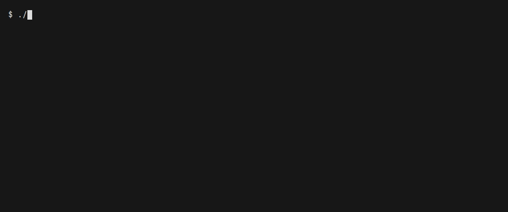

# argo-tui

A keyboard-first terminal UI for [Argo Workflows](https://argoproj.github.io/workflows/).
Browse workflows, inspect nodes and resources, stream logs, and resume, retry,
resubmit or stop a run with explicit confirmation.



## Build and try it

Requires Go 1.25 or later; the module selects Go 1.25.4 as its toolchain.

```sh
git clone https://github.com/ficaa1/argo-tui.git
cd argo-tui
make build
./dist/argo-tui --demo
```

Without Make, use `go build -o dist/argo-tui ./cmd/argo-tui`. `make build`
also stamps the Git commit into the binary. `--version` prints both version
and commit. The demo uses synthetic data without connecting to a cluster or
reading credentials. Press `?` for help and `q` to quit.

## Install

The repository is private, so `go install` and Homebrew cannot fetch it: both
need anonymous access. The release job still builds the binaries, the
checksums and the tap formula, so both paths start working on the day the
repository becomes public.

Until then, download a binary from
[the releases page](https://github.com/ficaa1/argo-tui/releases) while signed
in, verify it and put it on your PATH:

```sh
gh release download v0.3.1 --repo ficaa1/argo-tui \
  --pattern '*_darwin_arm64.tar.gz' --pattern checksums.txt
shasum -a 256 -c checksums.txt --ignore-missing   # sha256sum -c on Linux
tar -xzf argo-tui_0.3.1_darwin_arm64.tar.gz
```

## Connect

Copy [the example config](docs/argo-tui.config.example.yaml) to
`~/.config/argo-tui/config.yaml` and edit it for your cluster. A minimal
profile for managed forwarding is:

```yaml
currentProfile: dev
profiles:
  dev:
    kubeContext: my-cluster
    service: argo-workflows-server
    serviceNamespace: argo
    remotePort: 2746
    server: http://127.0.0.1:2746
    namespace: workflows
    tokenEnv: ARGO_TUI_TOKEN
```

Start it with no arguments and it opens the profile picker:

```sh
./dist/argo-tui
```

Or name the profile to connect to it directly:

```sh
./dist/argo-tui --profile dev
```

Managed forwarding requires `kubectl` on PATH and access through the named
Kubernetes context. argo-tui starts its own forward on a free loopback port
and closes it on exit. The profile's `server` supplies the scheme and path
prefix; the forward supplies the host and port. Use HTTPS if the Argo Server
expects TLS. For an already reachable endpoint, omit `kubeContext`, `service`,
`serviceNamespace` and `remotePort`; `server` is then used directly.

Configuration lookup checks `$XDG_CONFIG_HOME/argo-tui/config.yaml`, then
`~/.config/argo-tui/config.yaml`, then the OS user config directory, using
the first existing file. `--config PATH` selects a file explicitly.
With no `--profile` and no `--server`, argo-tui opens the profile picker and
connects to nothing until you choose. `currentProfile` places the cursor on a
row; it does not connect by itself. `P` reopens the picker at any time, and
switching profile is a full reconnection: in-flight requests are canceled, the
snapshot is dropped and the port-forward is closed before the next one starts.
With no config file the picker shows the path to write and a sample profile.

### Authentication and TLS

Configure exactly one of `tokenEnv` (an environment variable name) or
`tokenFile` (an absolute file path). The source is read for each request.
The current config validator requires a source even when no token is needed:
for Argo's server auth mode, keep `tokenEnv: ARGO_TUI_TOKEN` and leave that
variable unset or empty. An empty token sends no Authorization header.
For client auth, supply an accepted bearer token through that source;
the Kubernetes context does not provide an Argo token automatically.
There is no interactive SSO login.

HTTPS verifies certificates by default; `--ca-file` supplies a custom CA.
`--insecure-skip-tls-verify` disables verification for that invocation and
shows a warning. Plain HTTP is limited to loopback addresses. Redirects are
rejected. Never put literal tokens in command arguments or committed config.

### Actions

Actions are disabled by default. Enable them for a session with:

```sh
./dist/argo-tui --profile dev --allow-actions
```

Press `a` on the workflow list or in a workflow's detail view. The menu offers
only the verbs that apply to the workflow's phase:

| Key | Verb | Applies to |
| --- | --- | --- |
| `u` | resume | a suspended workflow |
| `z` | suspend | a running workflow that is not suspended |
| `r` | retry | a failed or errored workflow |
| `b` | resubmit | a finished workflow |
| `s` | stop | a running workflow; graceful, runs exit handlers |
| `t` | terminate | a running workflow; no exit handlers |
| `d` | delete | any workflow |

The confirmation identifies the target; only `y` confirms, and Enter and Esc
cancel. Terminate asks you to type the workflow's name. Delete cannot be undone,
so it asks twice: after `y`, a final screen deletes only on `D` (shift+d) and
any other key cancels. Neither the `d` that opened it nor the `y` that passed
the first step can finish it, however often it is pressed.

Before sending, the app reads the workflow again and refuses the action when
its identity changed or the verb no longer applies. It sends exactly one request
and never retries a write. The outcome is `CONFIRMED` when the expected end
state was observed (resumed, suspended, left its failed phase, reached a
terminal phase, gone), `ACCEPTED` when the server applied it but the end state
was not seen within five seconds, `REFUSED` when nothing was sent, and
`UNKNOWN` when the server may or may not have applied it; inspect the workflow
before deciding what to do next. The server's permissions remain authoritative.
Argo's action endpoints address workflows by name and have no UID precondition,
so a same-name replacement between the identity check and the write remains
possible. With the workflow archive enabled, a deleted workflow can still be
read from the archive, so its delete reports `ACCEPTED` rather than `CONFIRMED`.

#### Marks and bulk actions

`space` marks or unmarks the selected row; a marked row carries a `◆` in its
first column and the toolbar counts the marks. Marks follow their workflow
through refreshes, sorting and filtering. A mark hidden by the filter still
counts, and the toolbar says how many are hidden. A mark whose workflow is gone
from the snapshot is dropped, and switching namespace or profile clears them
all. `esc` clears the marks first and the filter on the next press.

With marks, `a` acts on every marked workflow, hidden ones included. The menu
says how many marked workflows each verb applies to, and the confirmation lists
them; workflows the verb does not apply to are left alone. A bulk terminate asks
you to type the number of workflows instead of a name. The requests are sent
one at a time, each with its own identity check and read-back, and none is ever
resent. A workflow that fails its check is refused without affecting the
others. `esc` during the run stops it after the request in flight; losing the
connection or the fresh snapshot stops it too. The result lists every workflow's
outcome with a total, and stays on screen until you close it. Closing it clears
the marks and refreshes the list.

#### Action journal

Every write attempt, refused ones included, appends one JSON line to
`$XDG_STATE_HOME/argo-tui/actions.jsonl` (by default
`~/.local/state/argo-tui/actions.jsonl`): time, profile, server, namespace,
name, UID, verb, outcome and error text. The file is created readable by you
only. A journal that cannot be written never blocks or changes an action; the
footer reports the first failure of the session. Sessions without
`--allow-actions` and the demo write nothing. To turn the journal off, set
`journal: false` at the top level of the config file.

## Everyday keys

| View | Keys |
| --- | --- |
| Navigation | `j`/`k` or arrows; `pgup`/`pgdn`; `gg`/`G` or `home`/`end` |
| Workflow list | `enter` open, `l` workflow logs, `/` filter, `s` sort, `p` phase, `n` namespace, `space` mark, `a` actions, `w` wide columns, `esc` clear marks then filter |
| Detail | `tab`/`shift+tab` switch Summary, Nodes and Resource; `r` refresh; `a` actions |
| Actions | `u` resume, `z` suspend, `r` retry, `b` resubmit, `s` stop, `t` terminate, `d` delete; `y` confirms, `D` finishes a delete |
| Nodes | `l` selected node's logs, `h` show skipped nodes, `p` phase filter |
| Resource | `v` hides or reveals parameter/output values |
| Logs | `t` follow tail, `space` pause scrolling, `c` container, `/` search, `n`/`N` matches, `&` only matching lines, `w` wrap, `L` source labels, `ctrl+t` server timestamps, `\|` pipe |
| Display | `f` borderless full screen, `y` copy, `o` open workflow in Argo UI |
| General | `P` switch profile, `?` help, `esc` back/cancel, `q` quit outside text entry, `ctrl+c` quit globally |

### Filtering and wide columns

`/` filters the list as you type. A plain word matches workflow names; the
rest is a small query language:

| Query | Matches |
| --- | --- |
| `etl report` | names containing `etl` and `report` (spaces separate terms; every term must match) |
| `etl\|report` | names containing either (`\|` joins alternatives within a term) |
| `!etl` | names not containing `etl`; `!` negates one alternative, so `!a\|b` is "not a, or b" |
| `/^demo-.*-\d+$/` | names matching a Go regular expression, case-insensitive |
| `~ddp` | names containing `d`, `d`, `p` in that order (fuzzy) |
| `phase=failed`, `phase!=succeeded` | the phase, case-insensitive; `suspended` is a phase here, and `running` includes it |
| `age<2h`, `age>1d` | time since the workflow started, or was created if it has not |
| `dur>10m` | run time; a running workflow counts until now |
| `label:team=data`, `label:team`, `label:!team` | a label's exact value, its presence, its absence |
| `tmpl=nightly` | started from this WorkflowTemplate or ClusterWorkflowTemplate |
| `cron=etl-hourly` | started by this CronWorkflow |

Durations take `s`, `m`, `h` and `d`, combined as in `1d12h`. A workflow with
no timestamp matches neither side of an `age` or `dur` bound. A term that does
not parse leaves the previous filter applied and shows its error in the
toolbar, and `enter` will not apply it; `esc` cancels the edit. Once applied,
the toolbar shows the filter as it was read, such as `phase=Failed & age<2h`.
Like the rest of the list, the filter runs on the collected snapshot, not on
the server.

`w` toggles wide columns: PROGRESS (the server's done/total count of pods, with
a bar), STARTED and FINISHED in local time, TEMPLATE, CRON and LABELS (the
labels no other column shows). As the pane narrows they drop in this order:
LABELS, CRON, FINISHED, MESSAGE, TEMPLATE, STARTED, PROGRESS. Without `w`, a
pane of 120 columns or more shows PROGRESS as well.

### Reading logs

A workflow's logs mix every pod, so each line starts with a label naming the
step it came from, or the pod when the step is not known yet, coloured per
source. `L` hides or shows the labels; a single pod's log starts without them.
`w` wraps long lines, keeping your place: the line at the bottom of the pane
stays there. A line whose first word after its timestamps is `ERROR`, `WARN`,
`DEBUG` or a similar level, or a JSON line whose `level` or `severity` field
names one, gets that word coloured; the rest of the line is left alone.

`&` shows only the lines matching the current `/` search, as in `less`; `&`
again or `esc` shows everything. The status line says how many lines are
shown out of how many are retained. Collection carries on underneath and the
retention limits are unchanged.

`ctrl+t` asks the server to put its own timestamp in front of every line. The
stream is reopened with the new setting, which replays the log from the start;
the lines already on screen stay, and a marker shows where the new stream
begins. `t` (follow) and `T` (the timeline elsewhere) were taken, so the
timestamp toggle is `t` with control.

Suspended workflows sort first by default and their waiting nodes are marked
`AWAITING RESUME`. Node logs require a known pod name: the adapter uses the
workflow's pod naming annotation and leaves the shortcut unavailable when
it cannot resolve one safely.

The profile picker (`P`, and the start screen) lists the profiles in your
config file with their server and namespace. Type to narrow the list; only a
configured profile can be chosen, because a name that is in no file names no
server to connect to.

The namespace picker offers configured `namespaces` and discovered namespaces;
you can also type a name. Discovery uses Argo's managed namespace or visible
workflows, so empty namespaces may need to be configured or typed.

Set `webURL` to the browser address of your Argo UI to use `o`. Clipboard
copy uses OSC52 and depends on terminal support. Log piping sends retained
lines to a command you enter, using `/bin/sh`; `pipeCommand` sets the initial
command (default `lnav`). Install that program separately.

## Flags

| Flag | Purpose |
| --- | --- |
| `--config PATH` | Select the configuration file |
| `--profile NAME` | Connect to this profile instead of opening the picker |
| `--server URL`, `--namespace NAME` | Override the profile endpoint or workflow namespace |
| `--token-file PATH`, `--ca-file PATH` | Override credential file or CA bundle |
| `--refresh-interval DURATION` | Poll interval, default `5s`; accepted range `1s`–`10m` |
| `--allow-actions` | Enable confirmed workflow actions (resume, suspend, retry, resubmit, stop, terminate, delete) |
| `--insecure-skip-tls-verify` | Disable TLS certificate verification |
| `--debug` | Emit sanitized lifecycle diagnostics |
| `--redact-values` | Open every workflow with parameter and output values hidden |
| `--demo` | Run the offline, read-only demo |
| `--version` | Print version and exit |

`--token-file` cannot be combined with a profile's `tokenEnv`; remove the
environment source from that profile before switching to a file.

## Troubleshooting and limits

- Startup errors name missing or invalid settings. Managed forwarding needs
  a complete target; every real connection needs an endpoint, namespace and
  configured token source.
- Authentication and permission failures are distinct. Check the token and
  Argo auth mode for 401; check access to the selected namespace for 403.
- A stale banner retains the last successful data while the connection recovers.
- Search and sorting apply to the collected workflow snapshot, capped at 5,000
  entries. Logs retain at most 10,000 lines or 8 MiB; pausing stops scrolling,
  not collection. Deleted pods or unavailable archived logs may prevent viewing logs.
- Parameter and output values are shown. Set `redactValues: true` at the top
  of the config file or on a profile, or pass `--redact-values`, to open every
  workflow with them hidden; `v` reveals them for the session. Log text,
  copied text and pipe output may contain sensitive application data either
  way.
- Workflow submission and parameter editing are not exposed in the UI.

Project history records live testing of v0.2.0 on macOS arm64 against Argo
Workflows v4.1.2 in server auth mode without TLS, including list/watch, node
logs, Resume and Stop. This does not establish live coverage of other server
versions, auth modes or all actions. Windows was cross-built, not validated
interactively; log piping currently requires `/bin/sh`.

See [development and testing](docs/development.md) for the code map, test
commands and opt-in cluster tests, and the [changelog](CHANGELOG.md) for
release history.

[Hands-on testing notes](docs/handson-testing.md) preserve operator feedback
and the changes made during live use.

## License

argo-tui is free software under the GNU General Public License version 3; see
[LICENSE](LICENSE). Copyright (C) 2026 Filip Biljic.
